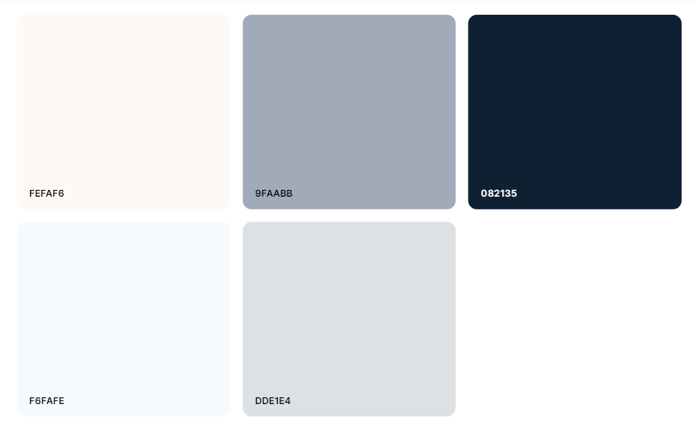
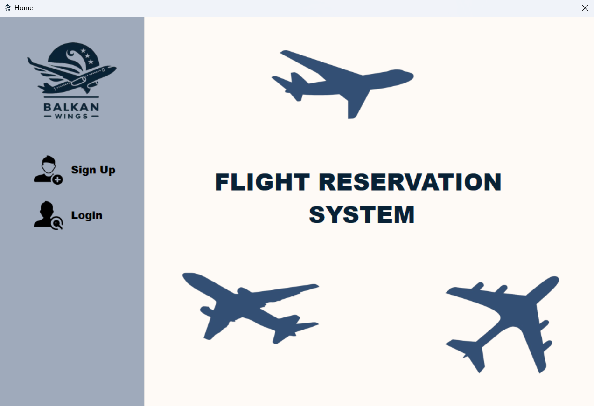
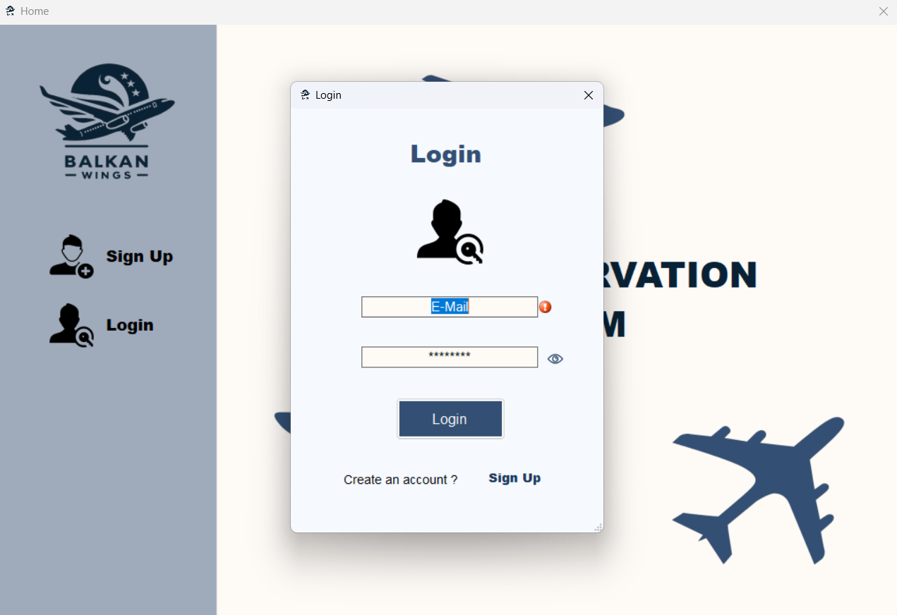
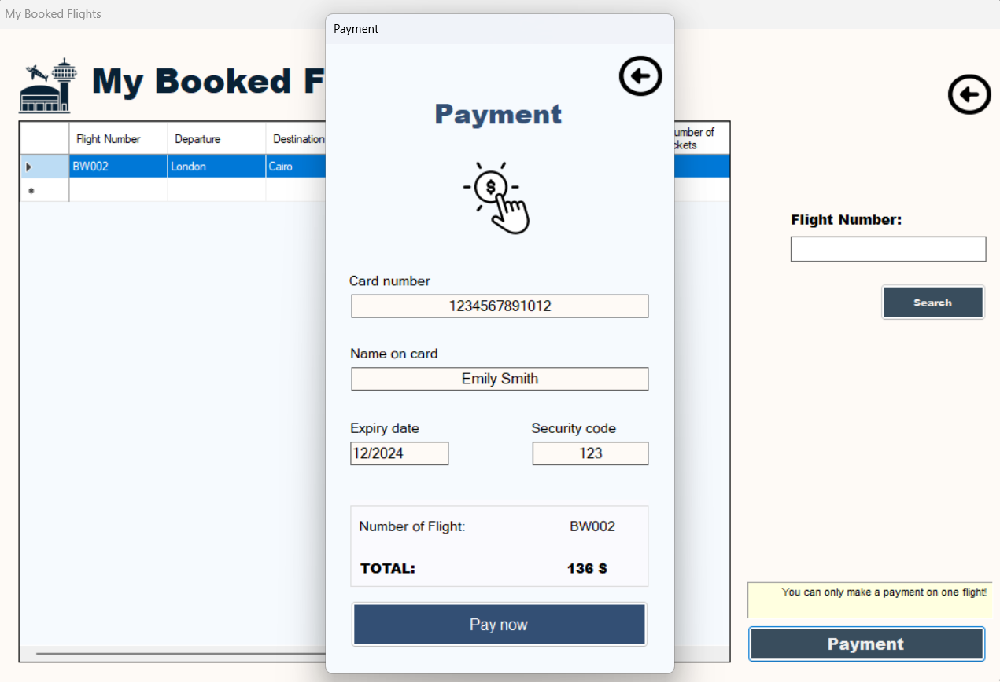

# Balkan Wings 
Главната идеја за изработка на овој проект е апликација за една авиокомпанија преку која клиентите ќе можат да резервираат летови.

Идејата за апликацијата за резервација на летови потекнува од потребата за едноставен и ефикасен начин кој луѓето ќе може да го користат за да резервираат летови. Со брзиот развој на патувањата и популарноста на воздушниот транспорт, постојано има потреба за алатки кои ќе им овозможат на корисниците да ги организираат своите патувања на поедноставен начин.

Одлучив да развивам ваков тип на апликација, бидејќи верувам дека соодветно дизајнираната и функционална апликација може да им овозможи на корисниците лесен и брз начин на резервација и преглед на летовите, кои ги обезбедува авиокомпанијата. Главната цел на овој проект е да се создаде алатка која ќе биде корисна и практична за широк спектар на луѓе, кои сакаат да резервираат летови со лесност и удобност.

# Реализација

Кога започнав да ја развивам апликацијата за резервација на летови, ја започнав од нула без претходна инспирација. Првенствено, се фокусирав на дефинирање на палета на бои кои ќе се користат во апликацијата. Изборот на бои беше клучен за креирање на пријатна корисничка прегледност.

Откако ги избрав боите, следниот чекор беше дизајнирање на логото на апликацијата. Логото беше создадено со цел да го одрази суштинскиот концепт и идентитет на апликацијата, како и компанијата за која истата е наменета.

Сите останати икони и елементи беа посебно дизајнирани со соодветни бои и стилови, за да се создаде конзистентен и привлечен визуелен изглед. Тоа ми помогна да креирам атрактивен дизајн на целата апликација, што на крај допринесе за подобро корисничко искуство и привлечен изглед на апликацијата.



**Палетата на горната слика беше примарниот извор на бои кои ги користев при креирање на апликацијата, но секако дополнително користев и нивни потемни и посветли нијанси.**

## Home

Главната, односно првата форма која се отвара при стартување на апликацијата е формата **Home**, која содржи две икони, **Sign Up**, доколку клиентот нема направено профил на апликацијата, и **Login** преку која клиентот директно може да влезе во неговиот веќе постоечки профил.

За секој корисник се креира посебен објект од класата **User**:
```csharp
 public class User
 {

     public string name { get; set; }
     public string surname { get; set; }

     public string email { get; set; }

     public string phone { get; set; }

     public string password { get; set; }

     public string Address = " "; 

     public string passport_num = " ";

     public List<booked_flight> booked_flights {  get; set; }


     public User(string name, string surname, string email, string phone, string password)
     {
         this.name = name;
         this.surname = surname;
         this.email = email;
         this.phone = phone;
         this.password = password;
         booked_flights= new List<booked_flight>();
     }

     public User()
     {
     }
 }
```


Формите за најава и креирање на профил користат повеќе различни функции, кои обезбедуваат брзо и точно креирање на профил за самата апликацја, како на пример, функција за проверка на валидност на е-маил адреса, проверка на лозинка и слично.

 

## Dashboard

Откако корисникот успешно ќе се најави, се појавува главната контролна табла на која имаме неколку функционалности:

- Пребарај лет
- Закажи лет
- Мои закажани летови
- Мој профил
- Излез


## Search for Flight 

Оваа форма содржи две Combo Box полиња кои ги содржат сите градови во кои корисникот може да патува преку авиокомпанијата. Со одбирање на два града во Data Grid View елементот се прикажуваат достапните летови со сите нивни информации кои се чуваат во објектот за секој лет.

За секој лет се креира посебен објект од класата **Flight**:
```csharp
public class Flight
{
    public string FlightNumber { get; set; }
    public string DepartureLocation { get; set; }
    public string ArrivalLocation { get; set; }
    public DateTime DepartureTime { get; set; }
    public DateTime ArrivalTime { get; set; }
    public string AircraftType { get; set; }
    public int TotalSeats { get; set; }
    public int AvailableSeats { get; set; }
    public int Price { get; set; }


    public Flight(string flightNumber, string departureLocation, string arrivalLocation, DateTime departureTime, DateTime arrivalTime, string aircraftType, int totalSeats, int availableSeats, int price)
    {
        FlightNumber = flightNumber;
        DepartureLocation = departureLocation;
        ArrivalLocation = arrivalLocation;
        DepartureTime = departureTime;
        ArrivalTime = arrivalTime;
        AircraftType = aircraftType;
        TotalSeats = totalSeats;
        AvailableSeats = availableSeats;
        Price = price;
    }

    public void bookseats(int num_tickets)
    {
        if (AvailableSeats > 0)
        {
            AvailableSeats-=num_tickets;
        }
    }


}
```


**На сликата е прикажан изгледот на формата при избирање на дестинација до која корисникот сака да лета !**

## Book a Flight

Во формата за резервација на лет првенствено е имплементиран Text Box во кој корисникот треба да го внесе бројот на лет кој би сакал да го закаже. Во деталниот дел за резервација, за летот автоматски се пополнуваат сите полиња, како и персоналните податоци на корисникот.

**Доколку корисникот не внесе број на пасош резервацијата ќе биде одбиена.**

Корисникот исто така може да резервира повеќе од една карта на негово име.


По закажување на летот се креира објект од класата **booked_flight**, а потоа се додава во листата на закажани летови која се чува за секој корисник.

**Класата booked_flight**
```csharp
 public class booked_flight
 {
     public Flight flight { get; set; }
     public int num_tickets { get; set; }

     public booked_flight(Flight flight, int num_tickets)
     {
         this.flight = flight;
         this.num_tickets = num_tickets;
     }
 }
```

**Функцијата за закажување на лет**

```csharp
private void bt_book_Click(object sender, EventArgs e)
{

    string passportNumber = tb_pas.Text.Trim();
    if (!string.IsNullOrWhiteSpace(passportNumber))
    {
        if (search_flight != null && search_flight.AvailableSeats > 0)
        {
            search_flight.bookseats((int)num_ticket.Value);
            booked_flight booked_Flight = new booked_flight(search_flight, (int)num_ticket.Value);
            current_user.booked_flights.Add(booked_Flight);

            MessageBox.Show("Booking successful!", "Success", MessageBoxButtons.OK, MessageBoxIcon.Information);
            this.DialogResult = DialogResult.OK;

        }
        
    }
    else
    {
        MessageBox.Show("Please enter a passport number.", "Input Error", MessageBoxButtons.OK, MessageBoxIcon.Error);
        return;
    }

}
```

## My Booked Flights

Оваа форма може да се отвори единствено ако корисникот има резервирано летови. Самата форма содржи Data Grid View во која се прикажуваат сите резервирани летови од страна на корисникот со сите нивни податоци, со помош на Search копчето корисникот може да пребара соодведен лет кој доколку постои ќе биде селектиран. Копчето Payment oвозможува онлајн плаќање на селектираниот лет ( отворање на формата за плаќање ). Со помош на копчето Unbook, селектираниот лет се брише од листата на селектирани летови.


**Функција за приказ на резервираните летови на корисникот**

```csharp
private void bookedflights_Load(object sender, EventArgs e)
{
    booked_flights_data_grid.Rows.Clear();
    booked_flights_data_grid.ColumnCount = 8;
    booked_flights_data_grid.Columns[0].Name = "Flight Number";
    booked_flights_data_grid.Columns[1].Name = "Departure";
    booked_flights_data_grid.Columns[2].Name = "Destination";
    booked_flights_data_grid.Columns[3].Name = "Departure Time";
    booked_flights_data_grid.Columns[4].Name = "Arrival Time";
    booked_flights_data_grid.Columns[5].Name = "Price";
    booked_flights_data_grid.Columns[6].Name = "Number of tickets";
    booked_flights_data_grid.Columns[7].Name = "Total Price";

    if (current_user.booked_flights.Count == 0)
    {
        DialogResult result = MessageBox.Show("You don't have any booked flights.", "No Booked Flights", MessageBoxButtons.OK,MessageBoxIcon.Information);
        if (result == DialogResult.OK)
        {
            this.DialogResult = DialogResult.OK;
        }

    }

    foreach (booked_flight booked in current_user.booked_flights)
    {
        booked_flights_data_grid.Rows.Add(booked.flight.FlightNumber,booked.flight.DepartureLocation,booked.flight.ArrivalLocation
            ,booked.flight.DepartureTime,booked.flight.ArrivalTime,booked.flight.Price+" $",booked.num_tickets,booked.flight.Price*booked.num_tickets+" $");
    }

    booked_flights_data_grid.SelectionMode = DataGridViewSelectionMode.FullRowSelect;

    booked_flights_data_grid.AllowUserToResizeRows = false;
    booked_flights_data_grid.AllowUserToResizeColumns = false;


}
```

**Доколку бројот на летови е нула тогаш горенаведената форма не се отвара.**

### Payment

Оваа форма се отвара само тогаш кога корисникот има селектирано еден лет. Корисникот, за да изврши успешна трансакција, мора да има внесено број на картичка, името кое е на картичката, датум на важност кој е поголем од моменталниот и CVV кое е со точна должина од три бројки.

Во долниот дел е прикажан летот кој ќе биде наплатен, како и точната сума која ќе биде одбиена од картичката.



По успешната реализација на наплата, летот се отстранува од резервираните летови и статусот на слободни места за самиот лет исто така се менува во зависност од наплатените карти.

## Функција за генерирање на летови

При секое стартување на апликацијата, се повикува функцијата **Generator** која се користи за генерирање на летови.

```csharp
public void generator()
{
    for (int i = 0; i < 250; i++)
    {
        string flightNumber = "BW" + (i + 1).ToString("000");
        string departureLocation = GetRandomLocation();
        string arrivalLocation = GetRandomLocation();
        if (departureLocation != arrivalLocation)
        {

        }
        else
        {
           
            while (departureLocation == arrivalLocation)
            {
                departureLocation = GetRandomLocation();
            }
        }
            DateTime departureTime = GetRandomDateTime();
            DateTime arrivalTime = departureTime.AddHours(new Random().Next(1, 12));
            string aircraftType = GetRandomAircraftType();
            int totalSeats = new Random().Next(100, 400);
            int a = new Random().Next(0, totalSeats);
            int price = new Random().Next(100,500);

            Flight flight = new Flight(flightNumber, departureLocation, arrivalLocation,
                                       departureTime, arrivalTime, aircraftType, totalSeats, a,price);

            flights.Add(flight);
        
        
    }


}

public static string[] locations = { "New York", "London", "Paris", "Tokyo", "Dubai",
                             "Los Angeles", "Sydney", "Moscow", "Berlin", "Rome",
                             "Beijing", "Toronto", "Istanbul", "Mumbai", "Cairo",
                             "Athens", "Vienna", "Madrid", "Lisbon", "Stockholm" };

static string GetRandomLocation()
{
    return locations[new Random().Next(locations.Length)];
}

static DateTime GetRandomDateTime()
{
    DateTime start = new DateTime(2024, 1, 1);
    int range = (DateTime.Today - start).Days;
    return start.AddDays(new Random().Next(range));
}

static string[] aircraftTypes = { "Boeing 777", "Airbus A380", "Boeing 787",
                                  "Airbus A350", "Embraer E190", "Bombardier CRJ900",
                                  "Boeing 737", "Airbus A320" };

static string GetRandomAircraftType()
{
    return aircraftTypes[new Random().Next(aircraftTypes.Length)];
}

```

Функцијата **Generator** креира 250 објекти од класата **Flight** со различен број на лет, случајно генерирани локации од низата локации **locations** ( локациите мора да се различни ), потоа се генерира случајно време на полетување со помош на функцијата **GetRandomDateTime**, додека пак времето на слетување се креира со тоа што се додаваат одреден број на часови на претходно генерираното време, функцијата **GetRandomAircraftType** ни овозможува случаен тип на авион, додека пак бројот на седишта во авионот секогаш ќе биде случаен број помеѓу 100 и 400 , а слободните места ќе се движат од 0, па се до максималниот број на седишта. Цената на картата секогаш ќе биде помеѓу 100$ и 500$. Секој генериран лет се додава во листата на летови.   

# Давор Младеновски 226042


